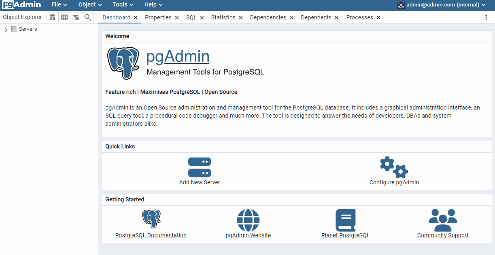
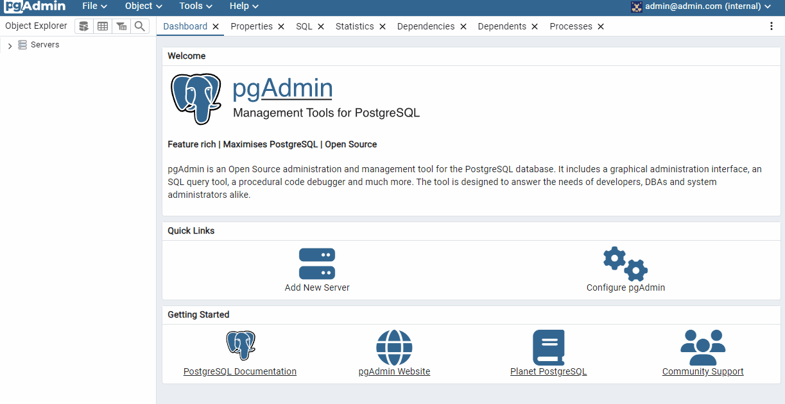

# Установка и настройка PostgteSQL в контейнере Docker

<p align="left">
    <a href="https://www.docker.com/" target="blank">
        
    </a>
    <a href="https://www.postgresql.org/" target="blank">
        
    </a>
</p>

## Оглавление

- [Подготовка](#подготовка)
- [Практика](#практика)

### Подготовка

Используемые Make-команды:

* `run` - запуск контейнера
* `stop` - остановка контейнера
* `clear` - удаление контейнера и его volume
* `rebuild` - пересборка контейнера

### Практика

<details>
  <summary> ✔️ создать ВМ с Ubuntu 20.04/22.04 или развернуть докер любым удобным способом и поставить на нем Docker Engine</summary>

Установлен Docker для Windows
</details>

<details>
  <summary> ✔️ сделать каталог `/var/lib/postgres`</summary>

В папке с домашней работой сделана директория `postgres`, которая игнорируется в git
</details>

<details>
  <summary> ✔️ развернуть контейнер с PostgreSQL 15 смонтировав в него <b>/var/lib/postgres</b></summary>

* Добавлен `docker-compose` с контейнером `db` для работы с PostgreSQL 15.6
* Указан volumes `./postgres:/var/lib/postgresql/data:rw`

</details>

<details>
  <summary> ✔️ развернуть контейнер с клиентом postgres</summary>

Добавлен `docker-compose` с контейнером `client` для работы с PgAdmin
</details>

<details>
  <summary> ✔️ подключится из контейнера с клиентом к контейнеру с сервером и сделать таблицу с парой строк</summary>

Данные для подключения к серверу:

- host: `host.docker.internal`
- port: `5434`
- user: `postgres`
- password: `postgres`
- database: `postgres`

Добавление данных:

  ```sql
  CREATE TABLE databases
  (
      id             serial PRIMARY KEY,
      is_open_source boolean,
      dbms_name      text
  );
INSERT INTO databases (is_open_source, dbms_name)
VALUES (TRUE, 'PostgreSQL'),
       (FALSE, 'Oracle'),
       (TRUE, 'MySQL'),
       (FALSE, 'MS SQL Server');
SELECT *
from databases;
  ```

Пример подключения к серверу и добавления тестовых данных:


</details>

✔️ подключится к контейнеру с сервером с ноутбука/компьютера извне инстансов GCP/ЯО/места установки докера


<details>
  <summary> ✔️ удалить контейнер с сервером и создать его заново</summary>

Команда для удаления с предварительной остановкой контейнера:

```shell
docker stop hw_02-db-1 && docker rm hw_02-db-1
```

Команда для запуска контейнера:

```shell
docker-compose up -d db
```

</details>

<details>
  <summary> ✔️ подключится снова из контейнера с клиентом к контейнеру с сервером и проверить, что данные остались на месте</summary>

Пример проверки примонтированного каталога данных после удаления контейнера:


</details>


**Вывод**: В результате выполнения практики были развернуты 2 контейнера в Docker для работы с PostgreSQL. Посредствам PgAdmin происходило добавление данных и их проверка после удаления контейнера с базой данных. Так как к контейнеру была примонтирована директория postgres, то удаление контейнера не повлияло на наличие данных.
