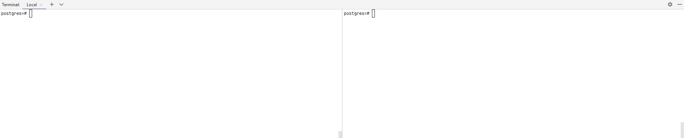
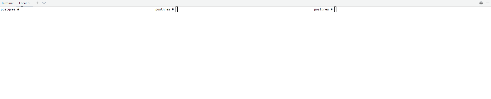
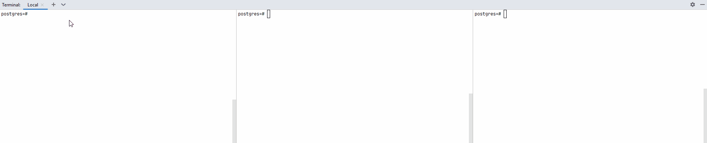
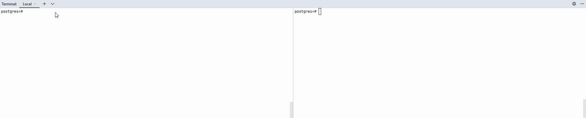

# Механизм блокировок

<p align="left">
    <a href="https://www.docker.com/" target="blank">
        
    </a>
    <a href="https://www.postgresql.org/" target="blank">
        
    </a>
</p>

В качестве рабочего окружения используется PostgreSQL 16 версии установленный в Docker.

Дополнительно устанавливается решение [ScreenToGif](https://www.screentogif.com/) - для составления интерактивного
отчета, так как работа идет с несколькими сессиями.

Каждый этап имеет следующую структуру:

* Номера затрагиваемых задач
* Краткий отчет о том, что было сделано
* Пример выполнения команд

## Оглавление

- [Задание](#задание)
- [Практика](#практика)
- [Используемые источники](#используемые-источники)

### Задание

1. Настройте сервер так, чтобы в журнал сообщений сбрасывалась информация о блокировках, удерживаемых более 200
   миллисекунд. Воспроизведите ситуацию, при которой в журнале появятся такие сообщения.
2. Смоделируйте ситуацию обновления одной и той же строки тремя командами UPDATE в разных сеансах. Изучите возникшие
   блокировки в представлении pg_locks и убедитесь, что все они понятны. Пришлите список блокировок и объясните, что
   значит каждая.
3. Воспроизведите взаимоблокировку трех транзакций. Можно ли разобраться в ситуации постфактум, изучая журнал сообщений?
4. Могут ли две транзакции, выполняющие единственную команду UPDATE одной и той же таблицы (без where), заблокировать
   друг друга?

### Практика

<details>
  <summary> ✔️ Работа с блокировками</summary>

**Затрагиваемые задачи**: 1

**Выполнение задания**:

* В ходе выполнения задания, были запущены 2 сессии с обновлением строк. Выполнение запросов и лог записей представлены
  ниже.



```bash
2024-06-01 08:00:00.000 UTC [60] ERROR:  deadlock detected
2024-06-01 08:00:00.000 UTC [60] DETAIL:  Process 60 waits for ShareLock on transaction 728; blocked by process 81.
        Process 81 waits for ShareLock on transaction 727; blocked by process 60.
        Process 60: update accounts set amount = amount + 10.00 where id = 2;
        Process 81: update accounts set amount = amount + 100.00 where id = 1;
2024-06-01 08:00:00.000 UTC [60] HINT:  See server log for query details.
2024-06-01 08:00:00.000 UTC [60] CONTEXT:  while updating tuple (0,2) in relation "accounts"
```

</details>

<details>
  <summary> ✔️ Обновление строки</summary>

**Затрагиваемые задачи**: 2

**Выполнение задания**:

```sql
-- Вспомагательный view для вывода информации по блокировкам
CREATE VIEW locks_accounts AS
SELECT pid,
       locktype,
       CASE locktype
           WHEN 'relation' THEN relation::regclass::text
           WHEN 'transactionid' THEN transactionid::text
           WHEN 'tuple' THEN relation::regclass||'('||page||','||tuple||')'
           END AS lockid,
       mode,
       granted
FROM pg_locks
WHERE locktype in ('relation', 'transactionid', 'tuple')
  AND (locktype != 'relation' OR relation = 'accounts'::regclass)
ORDER BY 1, 2, 3;
```

* В ходе выполнения задания, были запущены 3 сессии с обновлением 1-ой строки. Выполнение команд отображены в `.gif`,
  результаты блокировок представлены ниже.



```bash
postgres=# select * from locks_accounts where pid = 41;
```

| pid | locktype      | lockid   | mode             | granted |
|-----|---------------|----------|------------------|---------|
| 41  | relation      | accounts | RowExclusiveLock | t       |
| 41  | transactionid | 740      | ExclusiveLock    | t       |

* **RowExclusiveLock** — устанавливается на изменяемое отношение
* **ExclusiveLock** — удерживаются каждой транзакцией для самой себя

```bash
postgres=# select * from locks_accounts where pid = 71;
```

| pid | locktype      | lockid        | mode             | granted |
|-----|---------------|---------------|------------------|---------|
| 71  | relation      | accounts      | RowExclusiveLock | t       |
| 71  | transactionid | 740           | ShareLock        | f       |
| 71  | transactionid | 741           | ExclusiveLock    | t       |
| 71  | tuple         | accounts(0,4) | ExclusiveLock    | t       |

* **RowExclusiveLock** — устанавливается на изменяемое отношение
* **ShareLock** - устанавливается для первой транзакции
* **ExclusiveLock** — удерживаются каждой транзакцией для самой себя и отношения tuple

```bash
postgres=# select * from locks_accounts where pid = 94;
```

| pid | locktype      | lockid        | mode             | granted |
|-----|---------------|---------------|------------------|---------|
| 94  | relation      | accounts      | RowExclusiveLock | t       |
| 94  | transactionid | 742           | ExclusiveLock    | t       |
| 94  | tuple         | accounts(0,4) | ExclusiveLock    | f       |

* **RowExclusiveLock** — устанавливается на изменяемое отношение
* **ExclusiveLock** — удерживаются каждой транзакцией для самой себя


* Первая транзакция выполняется успешно и удерживает блокировку таблиц.
* Вторая транзакция ожидает выполнение 1-ой транзакции и добавляет 2 строки: блокировку типа tuple и блокировку номера
  1-ой транзакции.
* Третья транзакция захватывает блокировку версии строки.

</details>


<details>
  <summary> ✔️ Взаимоблокировки</summary>

**Затрагиваемые задачи**: 3

**Выполнение задания**:

* В ходе выполнения задания, были запущены 3 сессии с блокировкой и обновлением строк. Выполнение команд отображены
  в `.gif`, результаты рабочих блокировок представлены ниже.
* При попытке обновления строки в 3 сессии возникает циклическое ожидание, которое не решится само собой. Через
  несколько секунд происходит проверка взаимоблокировок и транзакция обрывается сервером.
* Исходя из записи логов можно будет увидеть лишь действие, которое привело к появлению блокировки, но не причину.



```sql
postgres=# select * from locks_accounts where pid = 70;
pid  |   locktype    |    lockid     |       mode       | granted
-----+---------------+---------------+------------------+---------
  70 | relation      | accounts      | RowShareLock     | t
  70 | relation      | accounts      | RowExclusiveLock | t
  70 | transactionid | 747           | ExclusiveLock    | t
  70 | transactionid | 748           | ShareLock        | f
  70 | tuple         | accounts(0,2) | ExclusiveLock    | t
(5 rows)
```

```sql
postgres=#select * from locks_accounts where pid = 41;
pid  |   locktype    |  lockid  |       mode       | granted
-----+---------------+----------+------------------+---------
  41 | relation      | accounts | RowShareLock     | t
  41 | relation      | accounts | RowExclusiveLock | t
  41 | transactionid | 748      | ExclusiveLock    | t
(3 rows)
```

```bash
2024-06-01 08:00:00.000 UTC [56] ERROR:  deadlock detected
2024-06-01 08:00:00.000 UTC [56] DETAIL:  Process 56 waits for ShareLock on transaction 747; blocked by process 70.
        Process 70 waits for ShareLock on transaction 748; blocked by process 41.
        Process 41 waits for ShareLock on transaction 749; blocked by process 56.
        Process 56: update accounts set amount = amount + 300 where id = 1;
        Process 70: update accounts set amount = amount + 100 where id = 2;
        Process 41: update accounts set amount = amount + 200 where id = 3;
2024-06-01 08:00:00.000 UTC [56] HINT:  See server log for query details.
2024-06-01 08:00:00.000 UTC [56] CONTEXT:  while updating tuple (0,7) in relation "accounts"
2024-06-01 08:00:00.000 UTC [56] STATEMENT:  update accounts set amount = amount + 300 where id = 1;
```

</details>

<details>
  <summary> ✔️ Взаимоблокировка команды update</summary>

**Затрагиваемые задачи**: 4

**Выполнение задания**:

* В ходе выполнения задания, были запущены 2 сессии с созданием курсоров для обновления данных - каждый курсов обновляет
  данные в указанном порядке(1 - по возрастанию значений id, 2-ой по убыванию).
* Так как команда update блокирует строки по мере их обновления, то при обновлении общих строк возникает
  взаимоблокировка. Выполнение запросов и лог данных представлены ниже.



```bash
2024-06-0208:00:00.000 UTC [70] ERROR:  deadlock detected
2024-06-0208:00:00.000 UTC [70] DETAIL:  Process 70 waits for ShareLock on transaction 753; blocked by process 41.
        Process 41 waits for ShareLock on transaction 752; blocked by process 70.
        Process 70: fetch c1;
        Process 41: fetch c2;
2024-06-0208:00:00.000 UTC [70] HINT:  See server log for query details.
2024-06-0208:00:00.000 UTC [70] CONTEXT:  while locking tuple (0,3) in relation "accounts"
2024-06-0208:00:00.000 UTC [70] STATEMENT:  fetch c1;
```

</details>

### Используемые источники

* [9.9.6. Задержка выполнения](https://postgrespro.ru/docs/postgrespro/16/functions-datetime#FUNCTIONS-DATETIME-DELAY)
* [13.3. Явные блокировки](https://postgrespro.ru/docs/postgresql/16/explicit-locking)
* [PostgreSQL 16 изнутри](https://edu.postgrespro.ru/postgresql_internals-16.pdf)
* [13. Блокировки строк](https://edu.postgrespro.ru/dba2-13/dba2_13_locks_rows.html)
