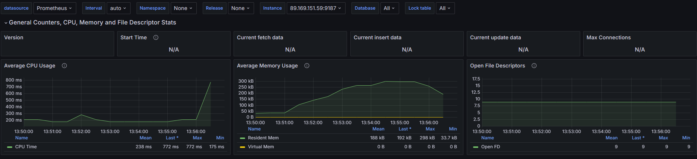
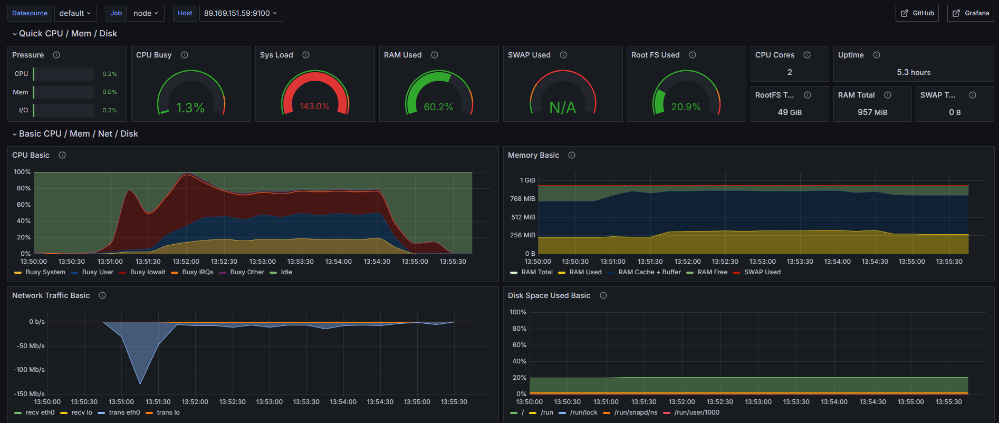
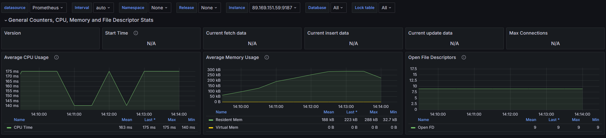
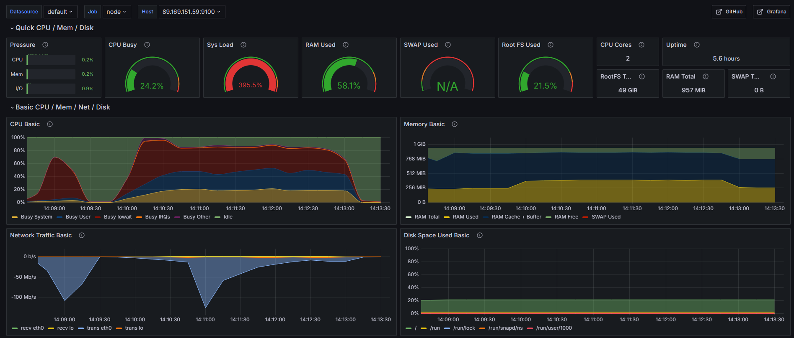

# Cоздание и тестирование высоконагруженного отказоустойчивого кластера PostgreSQL на базе Patroni

### Задача
В рамках дипломного проекта необходимо было построить и настроить кластер из 10 машин:

* HaProxy: 1 инстантс
* PgBouncer: 2 инстантса
* ETCD: 3 инстантса
* Patroni: 4 инстантса(мастер + 3 реплики)

В ходе работы были установлены все необходимые программные приложения.

Детальный ход установки и настройки описан в [файле](progress.md).

### Тестирование
Было выполнено 2 нагрузочных теста:

**1 тест**

Нагрузка в дашбордах(системные метрики, Postgres):

---
**2 тест**

Нагрузка в дашбордах(системные метрики, Postgres):

### Планы на будущее

- [ ] настроить репликацию: 1 — в синхронном режиме, 2 — в асинхронном режиме, 3 — в ждущем режиме — резерв;
- [ ] в случае падения мастера сделать переход на реплику с синхронной репликацией;
- [ ] если в течение 3 минут не поднялся мертвый инстанс предыдущего мастера, то ввести резервную реплику.
- [ ] донастроить работу балансировщиков;
- [ ] донастроить дашборд для PosgtreSQL(сейчас отображается лишь часть метрик)ж
- [ ] провести нагрузочное тестирование: 5000 конкурентных клиентов, убитый мастер во время теста.
