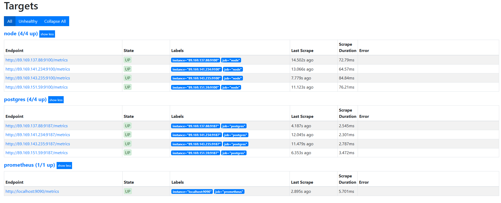

# Последовательный план настройки кластера

В данном файле приводится последовательный процесс настройки кластера.

## ETCD

```bash
# Добавление пользователя
sudo adduser etcd --disabled-password

# Добавление шаблона для ETCD - шаблон находится в папке config
sudo nano /tmp/etcd-temp.yml

# Установочный скрипт
sudo nano /root/etcd_installer.sh
```

Для каждой ноды указывается свой IP и имя в указанном ниже скрипте:
```shell
#!/bin/bash

echo "Установка ETCD"
ETCD_VER=v3.5.0
GOOGLE_URL=https://storage.googleapis.com/etcd
GITHUB_URL=https://github.com/etcd-io/etcd/releases/download
DOWNLOAD_URL=${GOOGLE_URL}

rm -f /work/etcd-${ETCD_VER}-linux-amd64.tar.gz
rm -rf /work/etcd/ && mkdir -p /work/etcd/

curl -L ${DOWNLOAD_URL}/${ETCD_VER}/etcd-${ETCD_VER}-linux-amd64.tar.gz -o /work/etcd-${ETCD_VER}-linux-amd64.tar.gz
tar xzvf /work/etcd-${ETCD_VER}-linux-amd64.tar.gz -C /work/etcd --strip-components=1
rm -f /work/etcd-${ETCD_VER}-linux-amd64.tar.gz

/work/etcd/etcd --version
/work/etcd/etcdctl version

sudo cp /work/etcd/etcd* /usr/local/bin

echo "Работа с переменными для шаблона"
export HOST_NAME="work-etcd-node-"
export ETCD_IP_1=""
export ETCD_IP_2=""
export ETCD_IP_3=""

export ETCD_IP="${ETCD_IP_3}"
export ETCD_NAME="${HOST_NAME}"
export ETCD_DATA_DIR="/work/etcd/data-dir"
export ETCD_WAL_DIR="/work/etcd/wal-dir"
export ETCD_LISTEN_PEER_URLS="0.0.0.0:2380"
export ETCD_LISTEN_CLIENT_URLS="0.0.0.0:2379"
export ETCD_ADVERTISE_CLIENT_URLS="${ETCD_IP}:2379"
export ETCD_INITIAL_ADVERTISE_PEER_URLS="${ETCD_IP}:2380"
export ETCD_INITIAL_CLUSTER="work-etcd-node-1=http://${ETCD_IP_1}:2380,work-etcd-node-2=http://${ETCD_IP_2}:2380,work-etcd-node-3=http://${ETCD_IP_3}:2380"
export ETCD_INITIAL_CLUSTER_TOKEN="etcd-cluster"

echo "Создание директорий/файлов и назначение прав"
sudo mkdir /etc/etcd
sudo touch /etc/etcd/etcd.yml
sudo mkdir -p /work/etcd/data-dir
sudo mkdir -p /work/etcd/wal-dir
sudo chown -R etcd:etcd /work/etcd
sudo chown -R etcd:etcd /etc/etcd

echo "Заполнение шаблона etcd.yaml"
sed -e "s|\${ETCD_NAME}|${ETCD_NAME}|g" \
    -e "s|\${ETCD_DATA_DIR}|${ETCD_DATA_DIR}|g" \
    -e "s|\${ETCD_WAL_DIR}|${ETCD_WAL_DIR}|g" \
    -e "s|\${ETCD_LISTEN_PEER_URLS}|${ETCD_LISTEN_PEER_URLS}|g" \
    -e "s|\${ETCD_LISTEN_CLIENT_URLS}|${ETCD_LISTEN_CLIENT_URLS}|g" \
    -e "s|\${ETCD_ADVERTISE_CLIENT_URLS}|${ETCD_ADVERTISE_CLIENT_URLS}|g" \
    -e "s|\${ETCD_INITIAL_ADVERTISE_PEER_URLS}|${ETCD_INITIAL_ADVERTISE_PEER_URLS}|g" \
    -e "s|\${ETCD_INITIAL_CLUSTER}|${ETCD_INITIAL_CLUSTER}|g" \
    -e "s|\${ETCD_INITIAL_CLUSTER_TOKEN}|${ETCD_INITIAL_CLUSTER_TOKEN}|g" \
    /tmp/etcd-temp.yml > /etc/etcd/etcd.yml

echo "Проверка заполненного YAML файла:"
head /etc/etcd/etcd.yml


echo "Установка значений для хостов"
sudo hostnamectl set-hostname "${HOST_NAME}" --static
sudo hostname "${HOST_NAME}"

sudo cat <<EOF | sudo tee -a /etc/hosts > /dev/null
$ETCD_IP_1 work-etcd-node-1
$ETCD_IP_2 work-etcd-node-2
$ETCD_IP_3 work-etcd-node-3
EOF


echo "Работа со службой"
SERVICE_FILE="/etc/systemd/system/etcd.service"

sudo cat <<EOF | sudo tee $SERVICE_FILE > /dev/null
[Unit]
Description=etcd key-value store
Documentation=https://github.com/coreos/etcd
After=network.target

[Service]
User=etcd
Type=notify
ExecStart=/work/etcd/etcd --config-file /etc/etcd/etcd.yml
Restart=always

[Install]
WantedBy=multi-user.target
EOF

echo "Перезапуск демона, добавление автоматического запуска и запуск ETCD"
sudo systemctl daemon-reload
sudo systemctl enable etcd
sudo systemctl start etcd
```

Запуск скрипта:
```bash
sudo chmod +x /root/etcd_installer.sh

sudo /root/etcd_installer.sh
```

Проверка кластера:

```bash
etcdctl member list --write-out=table
+------------------+---------+------------------+----------------------------+----------------------------+------------+
|        ID        | STATUS  |       NAME       |         PEER ADDRS         |        CLIENT ADDRS        | IS LEARNER |
+------------------+---------+------------------+----------------------------+----------------------------+------------+
| 4ae725e316241345 | started | work-etcd-node-3 | http://84.201.135.160:2380 | http://84.201.135.160:2379 |      false |
| e08ed18ecb983da7 | started | work-etcd-node-2 | http://89.169.159.136:2380 | http://89.169.159.136:2379 |      false |
| e8b81ea52a6182d0 | started | work-etcd-node-1 | http://89.169.138.113:2380 | http://89.169.138.113:2379 |      false |
+------------------+---------+------------------+----------------------------+----------------------------+------------+
```


## Установка Patroni для PostgreSQL в Ubuntu

```bash
# Добавление шаблона для Patroni - шаблон находится в папке config
sudo nano /tmp/pat-temp.yml

# Установочный скрипт
sudo nano /psql_installer.sh
```

Для каждой ноды указывается свой IP и имя в указанном ниже скрипте:
```shell
#!/bin/bash

echo "Установка Postgres:"
sudo apt-get install wget ca-certificates
wget --quiet -O - https://www.postgresql.org/media/keys/ACCC4CF8.asc | sudo apt-key add -
sudo sh -c 'echo "deb http://apt.postgresql.org/pub/repos/apt/ `lsb_release -cs`-pgdg main" >> /etc/apt/sources.list.d/pgdg.list'
sudo apt-get update
sudo apt install postgresql-13 postgresql-client-13 -y
psql --version
sudo systemctl stop postgresql


echo "Установка Patroni:"
sudo apt -y install python3-pip python3-dev libpq-dev
sudo pip3 install --upgrade setuptools pip
sudo pip3 install psycopg2-binary
sudo pip install --upgrade setuptools
sudo pip install patroni[etcd]


echo "Создание директорий и назначений прав:"
pg_config --bindir
sudo mkdir /etc/patroni
sudo touch /etc/patroni/patroni.yml
sudo mkdir -p /work/patroni

sudo chown -R postgres:postgres /etc/patroni
sudo chown -R postgres:postgres /work/patroni

sudo ls -al /etc/patroni
sudo ls -al /work/patroni


echo "Установка переменных для patroni.yml:"
export PAT_NODE=""
export PAT_NODE_HOST=""
export PAT_ETCD_HOSTS=":2379,:2379,:2379"

export PAT_NODE_1=""
export PAT_NODE_2=""
export PAT_NODE_3=""

sudo sed -e "s|\${PAT_NODE}|${PAT_NODE}|g" \
    -e "s|\${PAT_NODE_HOST}|${PAT_NODE_HOST}|g" \
    -e "s|\${PAT_ETCD_HOSTS}|${PAT_ETCD_HOSTS}|g" \
    -e "s|\${PAT_NODE_1}|${PAT_NODE_1}|g" \
    -e "s|\${PAT_NODE_2}|${PAT_NODE_2}|g" \
    -e "s|\${PAT_NODE_3}|${PAT_NODE_3}|g" \
    /tmp/pat-temp.yml > /etc/patroni/patroni.yml

echo "Проверка заполненного YAML файла:"
head /etc/patroni/patroni.yml


echo "Работа со службой Patroni"
SERVICE_PAT="/etc/systemd/system/patroni.service"

sudo cat <<EOF | sudo tee $SERVICE_PAT > /dev/null
[Unit]
Description=Patroni needs to orchestrate a high-availability PostgreSQL
Documentation=https://patroni.readthedocs.io/en/latest/
After=syslog.target network.target

[Service]
User=postgres
Group=postgres
Type=simple
ExecStart=/usr/local/bin/patroni /etc/patroni/patroni.yml
Restart=no

[Install]
WantedBy=multi-user.target
EOF


echo "Работа со службой Node Exporter"
SERVICE_NE='/etc/systemd/system/node_exporter.service'
sudo wget https://github.com/prometheus/node_exporter/releases/download/v1.3.1/node_exporter-1.3.1.linux-amd64.tar.gz
sudo tar xvfz node_exporter-1.3.1.linux-amd64.tar.gz
sudo mv node_exporter-1.3.1.linux-amd64/node_exporter /usr/local/bin/
sudo useradd --no-create-home --shell /bin/false node_exporter

sudo cat <<EOF | sudo tee $SERVICE_NE > /dev/null
[Unit]
Description=Node Exporter
After=network.target

[Service]
User=node_exporter
Group=node_exporter
Type=simple
ExecStart=/usr/local/bin/node_exporter

[Install]
WantedBy=multi-user.target
EOF


echo "Работа со службой Postgres Exporter"
SERVICE_PE='/etc/systemd/system/postgres_exporter.service'
sudo wget https://github.com/prometheus-community/postgres_exporter/releases/download/v0.15.0/postgres_exporter-0.15.0.linux-amd64.tar.gz
sudo tar xvfz postgres_exporter-0.15.0.linux-amd64.tar.gz
sudo mv postgres_exporter-0.15.0.linux-amd64/postgres_exporter /usr/local/bin/
sudo useradd --no-create-home --shell /bin/false postgres_exporter

sudo cat <<EOF | sudo tee SERVICE_PE > /dev/null
[Unit]
Description=PostgreSQL Exporter
After=network.target

[Service]
User=postgres_exporter
Group=postgres_exporter
Type=simple
ExecStart=/usr/local/bin/postgres_exporter \
    --web.listen-address=:9187 \
    --log.level=info

[Install]
WantedBy=multi-user.target
EOF

echo "Перезапуск демона и добавление автоматического запуска для служб"
sudo systemctl daemon-reload
sudo systemctl enable patroni
sudo systemctl enable node_exporter
sudo systemctl enable postgres_exporter
```

Запуск скрипта и служб:

```bash
sudo chmod +x /psql_installer.sh

sudo /psql_installer.sh

sudo systemctl start patroni
sudo systemctl status patroni

sudo systemctl start node_exporter
sudo systemctl status node_exporter


sudo systemctl start postgres_exporter
sudo systemctl status postgres_exporter
```

Проверка кластера:

```bash
patronictl -c /etc/patroni/patroni.yml list

user@psql-op-14-master-fsqdr:~$ patronictl -c /etc/patroni/patroni.yml list
+ Cluster: work (7428107824178587277) +-----------+----+-----------+
| Member   | Host           | Role    | State     | TL | Lag in MB |
+----------+----------------+---------+-----------+----+-----------+
| master   | 89.169.151.59  | Leader  | running   |  1 |           |
| replica1 | 89.169.137.88  | Replica | streaming |  1 |         0 |
| replica2 | 89.169.143.235 | Replica | streaming |  1 |         0 |
| replica3 | 89.169.141.234 | Replica | streaming |  1 |         0 |
+----------+----------------+---------+-----------+----+-----------+
```

Создание тестового пользователя и базы данных:

```sql
-- create user
CREATE ROLE rebrain_admin WITH LOGIN PASSWORD 'rebrain_admin_password';

-- create database
CREATE DATABASE pgbench_test;

-- check on database
\c pgbench_test

-- add rights
GRANT ALL PRIVILEGES ON DATABASE pgbench_test TO rebrain_admin;
```

## PgBouncer

```bash
# Установка PgBouncer
sudo apt-get update
sudo apt-get install -y pgbouncer

# Добавление настроек для PgBouncer
sudo nano /etc/pgbouncer/pgbouncer.ini
```

```ini
[databases]
courses_db = host= port=5432 dbname=courses_db user=pgbench_test

[pgbouncer]
listen_addr = 0.0.0.0
listen_port = 6432
auth_type = md5
auth_file = /etc/pgbouncer/userlist.txt
pool_mode = transaction
max_client_conn = 2500
default_pool_size = 50
logfile = /var/log/pgbouncer/pgbouncer.log
pidfile = /var/run/pgbouncer/pgbouncer.pid
admin_users = postgres
stats_users = postgres
ignore_startup_parameters = extra_float_digits
```

```bash
# Добавление настроек пользователя для PgBouncer
sudo nano /etc/pgbouncer/userlist.txt
```

```txt
"rebrain_admin" "md5a511c60150441d77e0ee7da4d8ebef6b"
```

Перезапуск демона, добавление автоматического запуска и запуск службы:

```bash
sudo systemctl daemon-reload
sudo systemctl enable pgbouncer
sudo systemctl start pgbouncer
sudo systemctl status pgbouncer
```


## HAProxy

```bash
# Установка HAProxy
sudo add-apt-repository ppa:vbernat/haproxy-2.4 -y
sudo apt install haproxy -y

# Добавление настроек HAProxy
sudo nano /etc/haproxy/haproxy.cfg
```

```cfg
listen stats
        mode http
        bind *:32700
        stats enable
        stats uri /

frontend ft_postgresql
        bind *:5432
        mode tcp
        default_backend bk_db

backend bk_db
        option httpchk
        mode tcp
        server <IP> <IP>:5432 maxconn 100 check port 8008
        server <IP> <IP>:5432 maxconn 100 check port 8008
```

Перезапуск демона, добавление автоматического запуска и запуск службы:

```bash
sudo systemctl daemon-reload
sudo systemctl enable haproxy
sudo systemctl restart haproxy
sudo systemctl status haproxy
```

## Prometheus/Grafana

```bash
# Установка Prometheus
sudo apt-get update
sudo apt-get install -y prometheus

# Настройки Prometheus
sudo nano /etc/prometheus/prometheus.yml
```

Для будущих дашбордов необходимо собирать метрики с кластера Patroni(системные настройки + Posgtres):

```yaml
scrape_configs:
  - 
  - job_name: 'prometheus'
    scrape_interval: 5s
    scrape_timeout: 5s.
    static_configs:
      - targets: ['localhost:9090']

  - job_name: node
    static_configs:
      - targets: [':9100', ':9100', ':9100', ':9100']

  - job_name: postgres
    static_configs:
      - targets: [':9187', ':9187', ':9187', ':9187']
```

Перезапуск демона, добавление автоматического запуска и запуск службы:

```bash
sudo systemctl daemon-reload
sudo systemctl enable prometheus
sudo systemctl restart prometheus
sudo systemctl status prometheus
```

Данные о логах кластера Patroni:



```bash
# Установка Grafana
sudo apt-get install -y adduser libfontconfig1 musl
wget https://dl.grafana.com/oss/release/grafana_11.2.2_amd64.deb
sudo dpkg -i grafana_11.2.2_amd64.deb
```

Перезапуск демона, добавление автоматического запуска и запуск службы:

```bash
sudo systemctl daemon-reload
sudo systemctl start grafana-server
sudo systemctl enable grafana-server
sudo systemctl status grafana-server
```

Работа с импортом дашбордов:

* Откройте Grafana и войдите в систему. 
* Перейдите в раздел "Dashboards" (Дашборды) в левом меню.
* Выберите "Manage" (Управление) в выпадающем меню.
* Нажмите кнопку "Import" (Импорт) в правом верхнем углу.
* Введите ID в поле "Import via grafana.com".
* Нажмите кнопку "Load" (Загрузить).
* Выберите источник данных Prometheus.
* Нажмите кнопку "Import" (Импорт).

Используемые дашборды:
* [Node Exporter Full](https://grafana.com/grafana/dashboards/1860-node-exporter-full/)
* [PostgreSQL Database](https://grafana.com/grafana/dashboards/9628-postgresql-database/)

Примеры дашбордов приводятся в секции тестирование файла README.md
